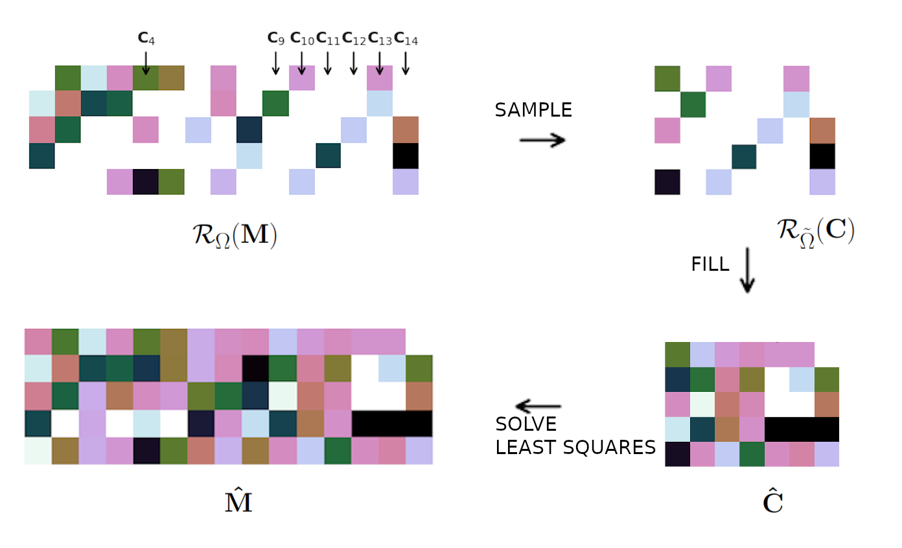

# CSMC 

CSMC is a Python library for performing column subset selection in matrix completion tasks. It provides an implementation of the CSSMC method, which aims to complete missing entries in a matrix using a subset of columns.

Columns Selected Matrix Completion (CSMC) is a two-stage approach for low-rank matrix recovery. In the first stage, CSMC samples columns of the input matrix  and recovers a smaller column submatrix.
In the second stage, it solves a least squares problem to reconstruct the whole matrix.



CSMC supports numpy arrays and pytorch tensors.

## Installation

You can install CSMC using pip:

```bash
pip install -i  csmc
```

## Usage
1. Generate random data
```python
import numpy as np
import random 

n_rows = 50
n_cols = 250
rank = 3

x = np.random.default_rng().normal(size=(n_rows, rank)) 
y = np.random.default_rng().normal(size=(rank, n_cols)) 
M = np.dot(x, y)

M_incomplete = np.copy(M)
num_missing_elements = int(0.7 * M.size)
indices_to_zero = random.sample(range(M.size), k=num_missing_elements)
rows, cols = np.unravel_index(indices_to_zero, M.shape)
M_incomplete[rows, cols] = np.nan
```

2. Fill with CSNN algorithm
```python
from csmc import CSMC
solver = CSMC(M_incomplete, col_number=100)
M_filled = solver.fit_transform(M_incomplete)
```

3. Fill with Nuclear Norm Minimization with SDP (NN algorithm)

```python
from csmc import NuclearNormMin
solver = NuclearNormMin(M_incomplete)
M_filled = solver.fit_transform(M_incomplete, np.isnan(M_incomplete))
```

## Algorithms
* `NuclearNormMin`: Matrix completion by SDP (NN algorithm) [Exact Matrix Completion via Convex Optimization](http://statweb.stanford.edu/~candes/papers/MatrixCompletion.pdf)
* `CSNN`: Matrix completion by CSNN
* `PGD`: Nuclear norm minimization using Proximal Gradient Descent (PGD)  [Spectral Regularization Algorithms for Learning Large Incomplete Matrices](http://web.stanford.edu/~hastie/Papers/mazumder10a.pdf) by Mazumder et. al.
* `CSPGD`: Matrix completion by CSPGD

## Examples

* [small synthetic matrices](examples/synthetic.ipynb)
* [big synthetic matrices](examples/synthetic_tensor.ipynb)
* [small images inpainting](examples/images.ipynb)
* [big images inpainting](examples/images.ipynb)
## Configuration

To adjust the number of [threads](https://pytorch.org/docs/stable/generated/torch.set_num_threads.html) used for intraop parallelism on CPU, modify variable: 

```
NUM_THREADS = 8
```
in settings.py


## Citation

Krajewska, A., Niewiadomska-Szynkiewicz E. (2023). Matrix Completion with Column Subset Selection.

Krajewska, A. (2023).  [Efficient matrix completion for data recovery in data-driven IT applications](https://www.e-bip.org.pl/upload/00998/37859/1088193-82224218.pdf). Systems Research Institute
Polish Academy of Sciences.